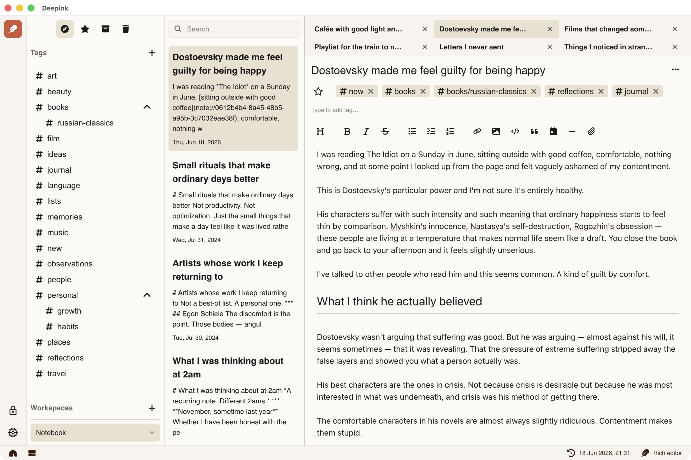

[](https://www.apache.org/licenses/LICENSE-2.0)
[](https://github.com/DeepinkApp/deepink)
[](https://deepink.app)

# Deepink — Snapshot Your Thoughts



> A better place for your notes. Deepink makes note-taking ergonomic, secure, and fun.

[**Deepink**](https://deepink.app) is an open-source, privacy-first note-taking application focused on security and user experience. Everything lives inside a single encrypted vault — your notes, files, attachments, and metadata — all unreadable to anyone but you.

With up to **80% fewer actions** than other note-taking apps for common tasks, Deepink is engineered for speed, clarity, and ergonomic everyday use.

[Download](https://deepink.app) the Deepink today, **build your safe space for thinking**!

## ✨ Features

| Feature | Description |
|---|---|
| 🔐 **Full Vault Encryption** | Notes, attachments, files, and metadata are [all encrypted](https://deepink.app/introduction/encryption/). Even file sizes are obfuscated. You choose the algorithm. (Read [Why it does even matter?](https://deepink.app/introduction/security/)) |
| ⚡ **Ergonomic by Design** | Friction removed from the most common tasks — up to 80% fewer actions than other apps. |
| 🗂️ **Workspaces** | Separate contexts (e.g. Client Projects, Personal Journal, Health Notes) inside one secure vault — no leaking between spaces. |
| 🔗 **Linked Notes** | Reference any note from anywhere. Backlinks make it easy to trace connections and navigate your knowledge graph naturally. |
| 🏷️ **Nested Tags** | Hierarchical tag structure (e.g. `Finance/Taxes`, `Clients/Acme`) with multi-tag support per note for flexible organization. |
| 🕓 **Note Version History** | Every note keeps a full change history. Restore any previous draft or trace how an idea evolved over time. |
| ⏰ **Reminders** | Attach reminders directly to notes. Get notified at the right time with all context already open and ready. |
| 📦 **Everything in One Vault** | Project specs, contracts, code snippets, book quotes, journal entries, research — all in one place. |

## 🔒 Privacy & Security

Deepink takes privacy seriously — beyond surface-level encryption:

- ✅ **End-to-end encryption** of all vault contents (not just sync data or note text, [unlike others](https://deepink.app/introduction/security/#why-deepink))
- ✅ **Metadata is encrypted** — including file sizes, which are obfuscated to prevent analysis
- ✅ **Open source** — code you can verify, not just trust
- ✅ **Your data stays yours** — unreadable even to the Deepink team

## Download

Visit [deepink.app](https://deepink.app) to download the app. **Free to use. No limits.**

## ❤️ Support & Contribute

This project is open-source under the Apache 2.0 License — it not only allows you to use and modify the code freely, but also protects contributors by explicitly granting patent rights and requiring proper attribution.

Contributions are very welcome — whether it’s code, ideas, bug reports, or improvements.

If you find this tool useful:

* ⭐ Star the [repository](https://github.com/DeepinkApp/deepink/)
* 📢 Share it with others
* 💡 Help shape it with your feedback

*Good tools get better when people care.*

Want to help?

* Fix something
* Suggest something
* Break something (and [report it](https://github.com/DeepinkApp/deepink/issues))

And if you like it, a [⭐ on GitHub](https://github.com/DeepinkApp/deepink/) goes a long way.

# Build

To build in dev mode run `npm run dev`, to run production code run `npm run build`.

This commands will build source files to directory `dist`.

# Packaging

To package app, you need first build it and then package it for your platform via `npm run make` command.

There are specific prerequisites per each platform. All instructions listed below.

<!-- TODO: add step to push artifacts from build machine to an S3 -->
Once requirements are meet
- Clone repo `git clone https://github.com/DeepinkApp/deepink.git`
- Checkout `cd deepink`
- Build and pack. Example for Windows: `make build artifacts`

## Windows

### Virtual machine setup

To build for Windows on Linux/macOS you can run a virtual machine via [QEMU](https://www.qemu.org/).

To setup environment
- [Download QEMU](https://www.qemu.org/download)
	- On Linux you can run `sudo apt-get install -y virt-manager` to install [virtual machine manager](https://virt-manager.org/), a GUI to manage QEMU
	- On macOS you can run `brew install virt-manager`
- [Download](https://www.microsoft.com/en-us/software-download/windows11) and install Windows
- Optionally: Once Windows is installed, you may configure [Guest Tools](https://pve.proxmox.com/wiki/Windows_VirtIO_Drivers) to enable shared clipboard and directories
	- Install a [guest tools](https://fedorapeople.org/groups/virt/virtio-win/direct-downloads/archive-virtio/virtio-win-0.1.285-1/virtio-win-guest-tools.exe) to enable shared clipboard
	- [Download WinFSP](https://winfsp.dev/rel/) and install. Once installed, go to "Services" find a "VirtIO-FS Service", start it and change "Startup type" in properties to an "Auto". See a [video guide](https://www.youtube.com/watch?v=UCy25VFMJCE&t=195s) "Share Files between KVM Host and Windows Virtual Machine" on YouTube
- Optionally: Update `winget`, a windows packages manager
	```powershell
	Invoke-WebRequest -Uri https://aka.ms/getwinget -OutFile $HOME/Downloads/Microsoft.DesktopAppInstaller_8wekyb3d8bbwe.msixbundle
	Add-AppxPackage -Path $HOME/Downloads/Microsoft.DesktopAppInstaller_8wekyb3d8bbwe.msixbundle

	# Optionally - update env in curren shell
	refreshenv
	```

Once you will done with these steps, it is good idea to backup disk image to not do all that steps again.


### Environment setup

To build on Windows, a dev environment is needed.

Update [security policy](https://learn.microsoft.com/en-us/powershell/module/microsoft.powershell.core/about/about_execution_policies?view=powershell-7.5) to allow run dev tools:
```powershell
Set-ExecutionPolicy -ExecutionPolicy Bypass -Scope LocalMachine
```

[Install chocolatey](https://chocolatey.org/install), a packages manager. If you have `winget` installed, just run
```powershell
winget install -e --id Chocolatey.Chocolatey
```

Once chocolatey is ready, install all necessary packages (run in PowerShell as Administrator)

```powershell
choco install -y git make nodejs-lts python
```

To package app for windows, a [WiX Toolset v3](https://docs.firegiant.com/wix/wix3/) must be installed:

```sh
choco install -y wixtoolset  --version=3.14.0

# Extend PATH to add WiX Toolset and make it visible for makers

# via PowerShell
[Environment]::SetEnvironmentVariable("PATH", $env:PATH + ";C:\Program Files (x86)\WiX Toolset v3.14\bin", "Machine")
# via cmd
setx /M PATH "%PATH%;C:\Program Files (x86)\WiX Toolset v3.14\bin"
```

## macOS

Before start build, an [Xcode](https://developer.apple.com/xcode/) must be installed and user agreement must be accepted.

In case you've update your OS recently and have problems with compiling anything, it may be a problem on Xcode side. The solution is to remove and install Xcode again.

## Linux

Next packages must be installed
- `deb`
- `rpm`

# Trouble shooting

## Linux

### The SUID sandbox helper binary was found, but is not configured correctly

Error occurs on Ubuntu when run `AppImage` and looks like that

```
[31456:1101/232759.563532:FATAL:sandbox/linux/suid/client/setuid_sandbox_host.cc:166] The SUID sandbox helper binary was found, but is not configured correctly. Rather than run without sandboxing I'm aborting now. You need to make sure that /tmp/.mount_DeepinGiNBDl/usr/lib/deepink/chrome-sandbox is owned by root and has mode 4755.
Trace/breakpoint trap (core dumped)
```

The issue is with the AppArmor configuration in Ubuntu 24.04, not the AppImage. The change in the configuration is explained in the release notes of Ubuntu 24.04 (security reasons). For example Fedora Linux have no such problem.

To fix this error you have few options.

**Run with `--no-sandbox`**

You can just run app with no sandbox like that

```
./Deepink-0.0.1-x64.AppImage --no-sandbox
```

**Disable restriction**

To disable restriction for a current session run

```sh
sudo sysctl -w kernel.apparmor_restrict_unprivileged_userns=0
```

this changes will be reverted back after reboot.

To persist this change, you can run

```sh
# create a local sysctl file with the setting
echo "kernel.apparmor_restrict_unprivileged_userns = 0" | sudo tee /etc/sysctl.d/local.conf

# apply now (reload all sysctl configs)
sudo sysctl --system
```

**Add AppArmor profile**

Configure profile and write at `/etc/apparmor.d/home.app.deepink`

```
abi <abi/4.0>
include <tunables/global>

profile deepink /home/your_username/apps/deepink.AppImage flags=(unconfined) {
  userns,
  include if exists <local/deepink>
}
```

# Releases

To release new version we have to

- Update version in `package.json`
- Create new tag
- Push changes and tag via `git push --follow-tags`

CI will automatically build app for all platforms, create new release on GitHub and publish artifacts.

## Pre-release

To publish pre release in one command run `npm run release-preview`.

This command will automatically bump version to something like `0.0.2-preview.5` and CI will publish it as pre-release.

We may create as many pre release versions as necessary before public release for such purposes as manual testing on specific target hardware.

Preview versions may be deleted anytime, and they will once public release will be published.

Pre release may have no descriptions.

## Publish new release

To publish new release bump version via `npm version` first. For example `npm version major` for major version or `npm version minor` for a minor version.

Then push changes and tag via `git push --follow-tags`.

Once new release is published, changelog must be added on releases page.