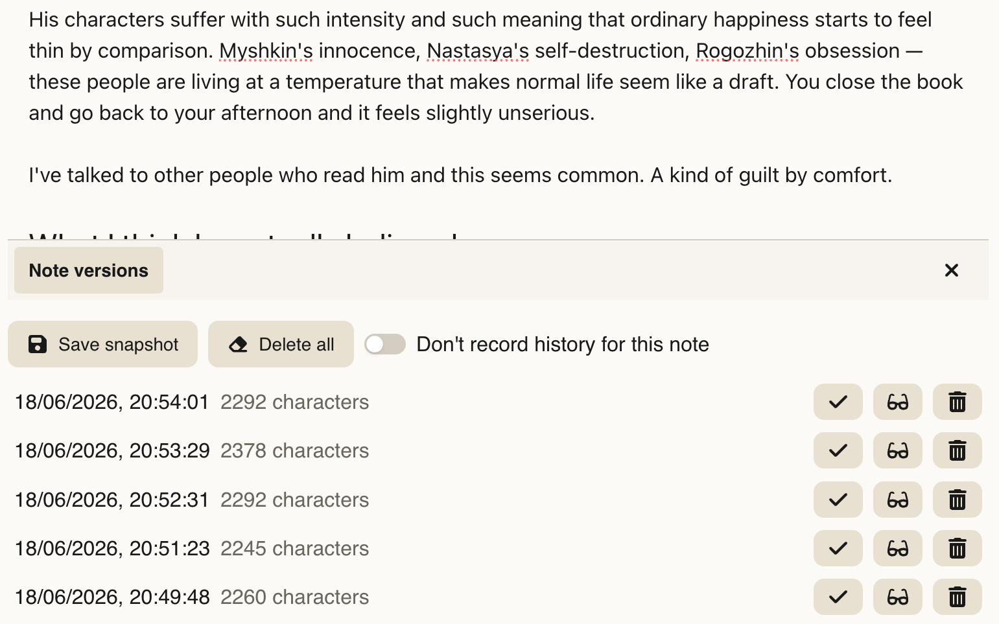

Each note has an editing history. Deepink takes snapshots of note content a few seconds after you finish editing, so you can restore a previous version of a note at any time.

That feature is especially useful to track the evolution of your ideas and processes over time.

## History behavior

History is linear. Each snapshot is appended in order of changes.

Restoring a snapshot replaces the current note content. After restore, any further edits create new snapshots as usual.

## History control

Some notes may contain sensitive content, and stored snapshots may expose past versions in those cases.

You can manually delete specific snapshots or disable history recording entirely for a specific note or for the whole vault.