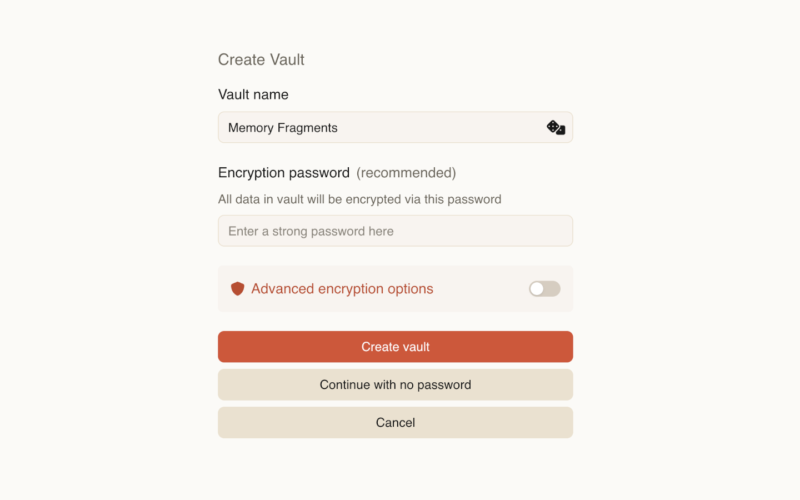

A vault is a top-level container that stores all your data.

Each vault is a directory on disk that contains workspaces, notes, attachments, and related metadata.

You can create multiple vaults, but only one vault can be open at a time.

## Encryption

A vault can be encrypted or unencrypted.

:::caution
When a vault is not encrypted, data is stored as plaintext and any app can read your notes and files.

Deepink lets you create an unencrypted vault, but we [recommend](/introduction/security/#why-do-i-need-to-encrypt-my-data) enabling encryption.
:::

When encryption is enabled, the vault directory contains only encrypted files, and a single password protects the entire vault.

You only need to remember one password per vault.

:::note
If you forget your password, it cannot be recovered. Nobody can recover it, not even us.
:::

Read more about encryption:
- [Why encryption does matter for you](/reference/encryption)
- [Deepink Encryption Design](/reference/encryption/)

## Opening a vault

When the application starts, the most recently used vault opens automatically.

If the vault is encrypted, you will be asked to enter its password.

## Switching vaults

You can switch between vaults at any time.

When switching:
- The current vault is closed
- Encryption keys are cleared from memory
- You are returned to the vault list to select another vault