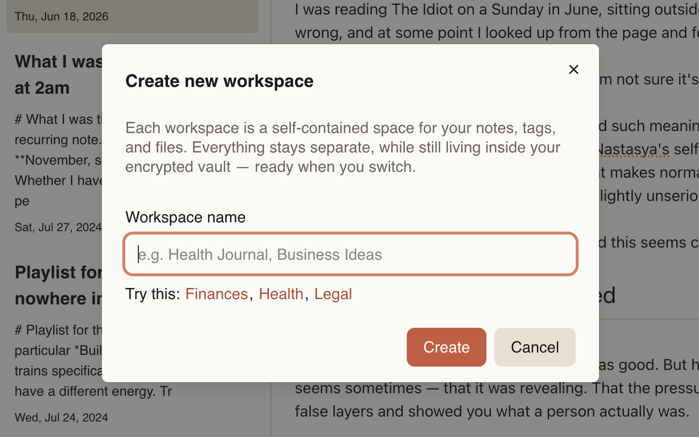

A workspace is a separate, isolated area inside your encrypted vault.

It is designed to split your data into independent domains — such as personal life, work, research, or drafts — so they never mix.

Each workspace is stored inside the same encrypted vault, but its content is fully isolated from other workspaces.

## Isolation

Every workspace is fully independent:
- Notes are not shared between workspaces
- Tags are not shared
- Files are not shared
- Workspace-specific preferences

You can switch workspaces quickly at any time, but you can work with only one workspace at once.

You only see the content of the currently selected workspace. All actions (creating notes, editing, searching) apply only to the active workspace.

When you delete a workspace, all its content is permanently deleted.