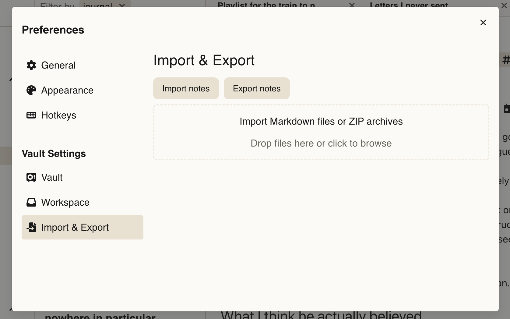

Deepink gives you full control over your notes.

You can import notes from external files into Deepink or export your notes at any time for backup, migration, or use in other applications.

Your data stays portable, making it easy to move notes between devices and services.

## Import

If you already have notes from another app, you can import them into Deepink.

- Click the "Global Settings" icon
- Open the "Import & Export" tab
- Drop your files, directories, or a ZIP archive to import

Attached files are uploaded automatically. Markdown links will be resolved and preserved.

Some frontmatter metadata in Markdown files is used — specifically creation and update time, title, and tags.

The directory structure is preserved as a tags tree. For example, if you drop a directory named `notes`, a file `notes/diary/sport/june.md` is imported as a note named `june` with the tag `diary/sport`.

## Export

You can export a single note or an entire workspace.

To export one note, open the note menu, click "Export...", and select a directory to save to.

To export a whole workspace:

- Click the "Global Settings" icon
- Open the "Import & Export" tab
- Click "Export notes"

This exports all notes in the active workspace. If you have multiple workspaces, repeat the process for each one — Deepink isolates workspace content, so each workspace only contains its own data.