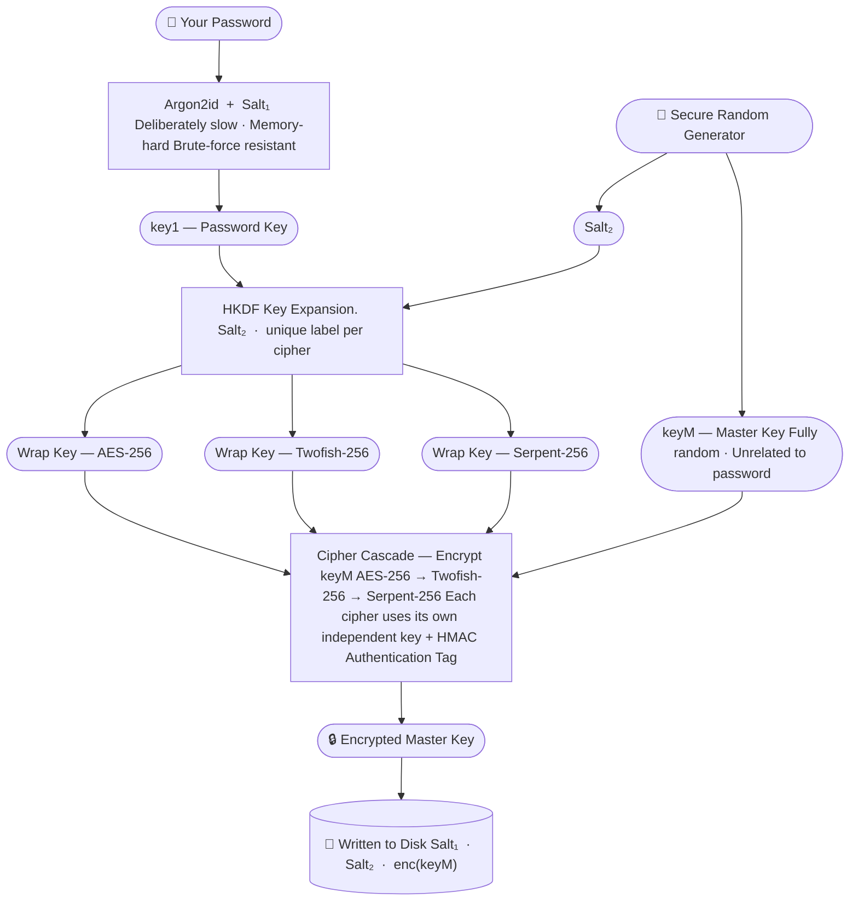
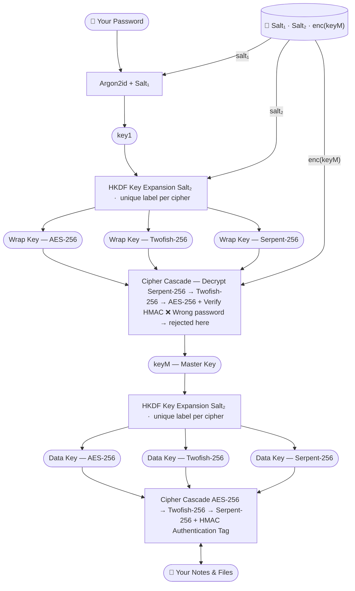

## Before All Else

Imagine your most important documents locked inside a safe. Now imagine that safe is welded shut inside a second safe, which is inside a third, all of them bolted to the floor of a vault deep underground. That's roughly what happens to your data — except instead of metal and steel, we use mathematics that the world's most powerful computers cannot break.

When you set your password, we never save it. Not on your device, not on a server, nowhere. Your password is used to unlock a tiny lockbox that holds your real vault key — a key that is completely random and has nothing to do with your password. Your actual notes and files are locked with that random key. This means if you ever change your password, only the lockbox changes. Your files — however many you have — stay untouched, instantly re-accessible.

That lockbox protecting your random vault key isn't secured by one lock. It's wrapped in several independent encryption algorithms stacked on top of each other. An attacker would need to defeat all of them at the same time. Nobody has ever broken even one of these algorithms in over two decades of the world's brightest cryptographers trying.

> **We never see your password. We never see your files. If someone stole your vault file from your device, they would see nothing but meaningless random bytes — and without your password, that is all it will ever be.**

---

## The Full Scheme 

> The diagrams below reflect the default triple-cipher configuration. The number of cipher layers can be adjusted in your settings — at least one is always active.

### 🔧 Creating Your Vault



### 🔓 Opening Your Vault and Using It



---

## Why You Are Safe — In Plain Words

- 🔑 **Your password is never stored.** It is processed through a one-way mathematical function. There is nothing to steal.
- 🎲 **Your files are encrypted with a fully random key.** That key was generated independently of your password, making it immune to dictionary attacks entirely.
- 🪪 **Changing your password is instant.** Only the small encrypted lockbox holding your vault key is replaced. None of your files are touched.
- 🏰 **Multiple cipher walls.** Your vault key and your data are each encrypted by several independent algorithms in sequence. Every single one would need to be broken to reach your data.
- 🔏 **Tamper detection.** Every encrypted package carries an authentication tag. If anything is modified — even a single bit — the vault refuses to open and reports the corruption immediately.
- 🚫 **We cannot help attackers.** The design contains no backdoor, no recovery key held by us, no mechanism to bypass your password. This is intentional and verifiable.

---

## Technical Deep Dive

### Phase 1 — Creating Your Vault

**Step 1 — Hardening your password with Argon2id**

Your password alone would be too weak to use as an encryption key directly. We pass it through Argon2id — a memory-hard key derivation function — together with a randomly generated `salt₁`:

$$\text{key}_1 = \text{Argon2id}(\text{password},\ \text{salt}_1,\ m,\ t,\ p)$$

The parameters $m$ (memory), $t$ (time iterations) and $p$ (parallelism) are tuned so that a single derivation takes a meaningful fraction of a second on modern hardware. This makes bulk brute-force attacks computationally prohibitive. All three parameters are stored alongside `salt₁` in the vault header so they can be reproduced exactly when you next unlock.

**Step 2 — Generating the Master Key**

A cryptographically secure random number generator produces `keyM` — your master key. This key is never derived from your password. It has maximum entropy and is completely independent.

**Step 3 — Expanding wrap keys via HKDF**

We need one independent encryption key per cipher in the cascade. A single HKDF call per cipher — each using a unique `info` label — produces them all from `key₁` and `salt₂`:

$$\text{wrapKey}_i = \text{HKDF}(\text{IKM} = \text{key}_1,\ \text{salt} = \text{salt}_2,\ \text{info} = \texttt{"wrap-cipher-}i\texttt{"})$$

The `info` label guarantees the keys are domain-separated: even though they share the same input material, they are computationally independent outputs. Knowing one reveals nothing about another.

**Step 4 — Encrypting the Master Key through the Cipher Cascade**

`keyM` is encrypted through each configured cipher in sequence, each using its own dedicated `wrapKey`:

```
enc₁ = AES-256-Encrypt(wrapKey₁, IV₁, keyM)
enc₂ = Twofish-256-Encrypt(wrapKey₂, IV₂, enc₁)
enc₃ = Serpent-256-Encrypt(wrapKey₃, IV₃, enc₂)
final = HMAC-SHA512(authKey, enc₃)  ‖  enc₃
```

Each IV is freshly generated at random per operation. Additionally, each cipher operates under a uniquely derived key — so even if the same IV bytes appeared across ciphers, the `(key, IV)` pairs remain distinct, eliminating cross-cipher nonce collision risk.

The HMAC authentication tag wraps the entire ciphertext. Any modification to the stored blob — even a single flipped bit — causes HMAC verification to fail immediately upon the next unlock attempt.

**Step 5 — Writing to Disk**

Only the following is written to disk. Nothing else.

| Stored Value | Size | Secret? |
|---|---|---|
| `salt₁` | 32 bytes | No — public salt |
| Argon2id parameters $(m, t, p)$ | ~12 bytes | No |
| `salt₂` | 32 bytes | No — public salt |
| `enc(keyM)` + HMAC tag | key size + tag | Ciphertext only |

`key₁`, `keyM`, and all derived keys are zeroed from memory immediately after use.

---

### Phase 2 — Opening Your Vault

**Step 1 — Re-derive `key₁`**

`salt₁` and the Argon2id parameters are read from disk. Your password is passed through the same Argon2id function, producing the same `key₁` as during setup — if and only if the password is correct.

**Step 2 — Re-derive wrap keys**

HKDF is run identically to setup, producing the same set of `wrapKey` values.

**Step 3 — Decrypt and authenticate the Master Key**

The cipher cascade is reversed (decryption order is the inverse of encryption), and the HMAC tag is verified first:

```
Verify HMAC(authKey, enc₃)           → ✅ or ❌ abort
dec₂ = Serpent-256-Decrypt(wrapKey₃, IV₃, enc₃)
dec₁ = Twofish-256-Decrypt(wrapKey₂, IV₂, dec₂)
keyM = AES-256-Decrypt(wrapKey₁, IV₁, dec₁)
```

A wrong password produces a wrong `key₁`, which produces wrong `wrapKey` values, which produces garbage decryption output, which fails HMAC verification. The vault rejects access cleanly.

**Step 4 — Derive data keys**

With `keyM` recovered, a second round of HKDF expansion produces the data-layer cipher keys:

$$\text{dataKey}_i = \text{HKDF}(\text{IKM} = \text{keyM},\ \text{salt} = \text{salt}_2,\ \text{info} = \texttt{"data-cipher-}i\texttt{"})$$

Note that the `info` namespace (`"data-cipher-*"`) is distinct from the wrap-key namespace (`"wrap-cipher-*"`). Even though `salt₂` is shared between both HKDF layers, the different IKMs (`key₁` vs `keyM`) and different `info` prefixes ensure the two sets of derived keys are fully independent.

**Step 5 — Encrypt / Decrypt your data**

Your notes, files and attachments are encrypted through the same cipher cascade structure, now keyed by `dataKey` values. Every individual item gets its own fresh random IV. The HMAC tag on each item ensures both integrity and authenticity.

---

<details>
<summary><strong>📋 Algorithm Reference</strong></summary>

| Algorithm | Role | Standard |
|---|---|---|
| **Argon2id** | Password → `key₁` derivation | RFC 9106 / PHC Winner |
| **HKDF-SHA512** | Key expansion and domain separation | RFC 5869 |
| **AES-256** | Cipher layer 1 | FIPS 197 |
| **Twofish-256** | Cipher layer 2 | AES finalist |
| **Serpent-256** | Cipher layer 3 | AES finalist, highest security margin |
| **HMAC-SHA512** | Ciphertext authentication | RFC 2104 |
| **CSPRNG** | `keyM`, `salt₁`, `salt₂`, IVs | OS-provided (e.g. `/dev/urandom`, `BCryptGenRandom`) |

</details>

<details>
<summary><strong>🛡️ Threat Model and Security Properties</strong></summary>

| Threat | Mitigation | Result |
|---|---|---|
| Password brute-force | Argon2id with high memory/time cost | Millions of guesses per second → a few per second |
| Stolen vault file | Everything encrypted; salts alone are useless | Attacker sees only random bytes |
| Cipher broken in future | Multi-cipher cascade | Security holds as long as one cipher remains unbroken |
| Ciphertext tampering | HMAC-SHA512 on every encrypted object | Tampering detected immediately; vault rejects access |
| Password change cost | `keyM` indirection | Only `enc(keyM)` is re-wrapped; all data stays unchanged |
| Nonce/IV collision | Per-operation random IVs + HKDF-derived per-cipher keys | Effective (key, IV) space prevents collision in practice |
| Key reuse across layers | HKDF domain separation via `info` labels | Each key is cryptographically independent |
| Memory forensics | Keys zeroed after use | No long-lived key material in RAM |

</details>