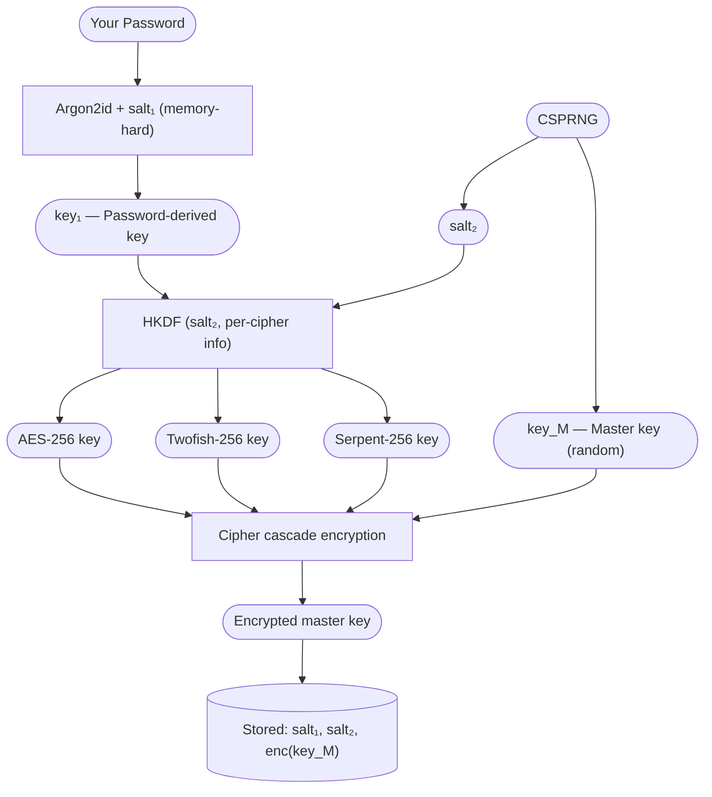
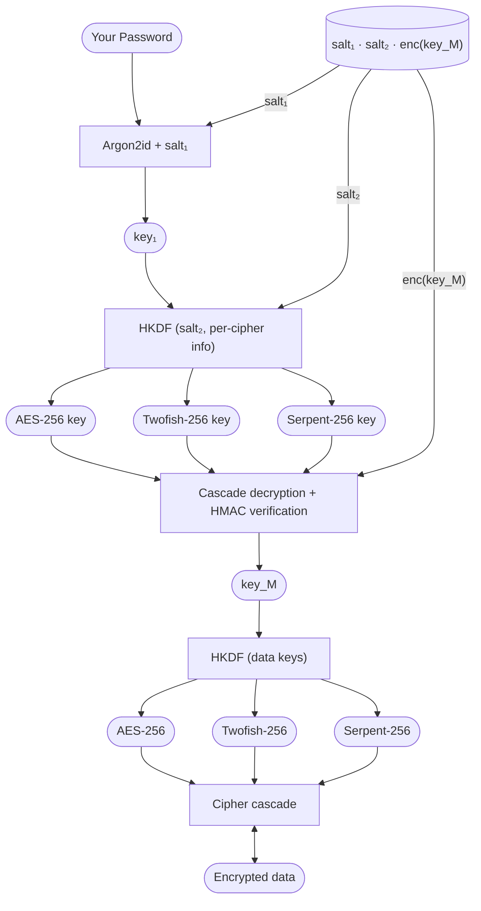

Consider your data secured inside multiple independent layers of protection. In this design, those layers are not physical barriers but well-studied cryptographic constructions designed to resist both current and future attacks.

Your password is never stored. It is used only to derive a key that unlocks a small encrypted container holding the actual vault key. This vault key is generated randomly and is entirely independent of your password. All user data is encrypted with this random key.

As a result:

- Changing your password does not require re-encrypting your data
- Your data security does not depend directly on password strength alone
- An attacker must defeat multiple independent cryptographic layers

*At no point do we have access to your password or your data. A stolen vault file reveals only indistinguishable random data.*

## Security Properties (Summary)

* **Password is never stored** — only a derived key is used
* **Data is encrypted with a random master key** — independent of the password
* **Password changes are constant-time** — only the wrapped master key is updated
* **Multiple cipher layers** — security holds if at least one remains secure
* **Integrity protection** — all ciphertext is authenticated
* **No recovery mechanism** — no backdoors or server-side keys exist

## Technical Details

### Phase 1 — Vault Creation

#### Password Hardening

The password is transformed using [Argon2id](https://en.wikipedia.org/wiki/Argon2):

$$
\mathrm{key}_1 = \mathrm{Argon2id}(\mathrm{password}, \mathrm{salt}_1, m, t, p)
$$

Parameters:

* $m$: memory cost
* $t$: time cost
* $p$: parallelism

These parameters are stored alongside $\mathrm{salt}_1$.

#### Master Key Generation

A cryptographically secure random generator produces:

$$
\mathrm{key}_M \leftarrow \mathrm{CSPRNG}
$$

This key is independent of the password and has full entropy.

#### Wrap Key Derivation (HKDF)

For each cipher layer:

$$
\mathrm{wrapKey}_i =
\mathrm{HKDF}(
\mathrm{IKM} = \mathrm{key}_1,\
\mathrm{salt} = \mathrm{salt}_2,\
\mathrm{info} = \text{"wrap-cipher-}i\text{"}
)
$$

This ensures domain separation between keys.

#### Master Key Encryption

The master key is encrypted through a cascade:

$$
\begin{aligned}
c_1 &= \mathrm{Enc}*{AES}(k_1, IV_1, \mathrm{key}*M) \
c_2 &= \mathrm{Enc}*{Twofish}(k_2, IV_2, c_1) \
c_3 &= \mathrm{Enc}*{Serpent}(k_3, IV_3, c_2)
\end{aligned}
$$

Authentication:

$$
\mathrm{final} = \mathrm{HMAC}*{SHA512}(k*{auth}, c_3) \ | \ c_3
$$

#### Stored Data

| Value                          | Description                |
| ------------------------------ | -------------------------- |
| $\mathrm{salt}_1$              | Argon2 salt                |
| $(m, t, p)$                    | Argon2 parameters          |
| $\mathrm{salt}_2$              | HKDF salt                  |
| $\mathrm{enc}(\mathrm{key}_M)$ | Encrypted master key + tag |

### Phase 2 — Vault Unlock 

#### Re-deriving the Password Key

$$
\mathrm{key}_1 = \mathrm{Argon2id}(\mathrm{password}, \mathrm{salt}_1, m, t, p)
$$

#### Master Key Recovery

1. Verify authentication tag
2. Decrypt cascade (reverse order):

$$
\begin{aligned}
c_2 &= \mathrm{Dec}*{Serpent}(k_3, IV_3, c_3) \
c_1 &= \mathrm{Dec}*{Twofish}(k_2, IV_2, c_2) \
\mathrm{key}*M &= \mathrm{Dec}*{AES}(k_1, IV_1, c_1)
\end{aligned}
$$

Incorrect passwords result in authentication failure.

#### Data Key Derivation

$$
\mathrm{dataKey}_i =
\mathrm{HKDF}(
\mathrm{IKM} = \mathrm{key}_M,\
\mathrm{salt} = \mathrm{salt}_2,\
\mathrm{info} = \text{"data-cipher-}i\text{"}
)
$$

#### Data Encryption

User data is encrypted using the same cascade structure with fresh IVs and authentication tags per object.

## Algorithm Reference

| Algorithm   | Purpose                 |
| ----------- | ----------------------- |
| Argon2id    | Password key derivation |
| HKDF-SHA512 | Key expansion           |
| AES-256     | Cipher layer            |
| Twofish-256 | Cipher layer            |
| Serpent-256 | Cipher layer            |
| HMAC-SHA512 | Authentication          |
| CSPRNG      | Random generation       |

## Threat Model

| Threat              | Mitigation               |
| ------------------- | ------------------------ |
| Brute-force attacks | Argon2id with high cost  |
| Stolen vault file   | Full encryption          |
| Cipher failure      | Multi-cipher cascade     |
| Tampering           | HMAC authentication      |
| Key reuse           | HKDF domain separation   |
| IV collision        | Random IVs per operation |
| Memory exposure     | Key zeroization          |
