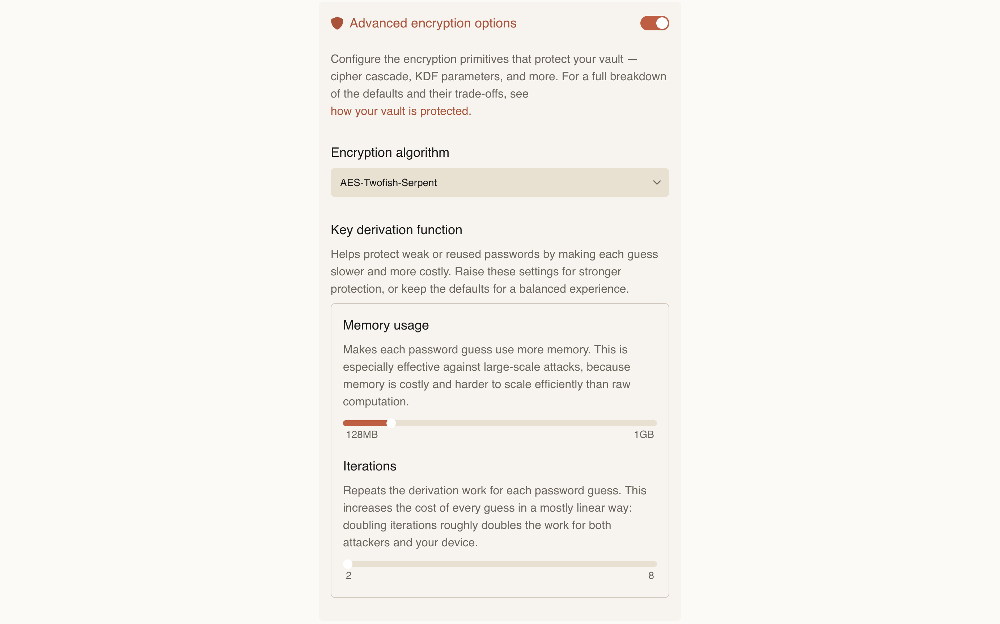

The Deepink mission is to make note-taking simple, quick, and safe.

Deepink’s ergonomics are explained in the [introduction](/introduction). Now let’s explore the security aspect.

## Why do I need to encrypt my data?

We live in the age of computers. Computers contain many insights about their owners.

There are people who exploit that fact — for corporate spying, blackmail, hacking, phishing, targeted marketing, and other abuses.

Your personal notes [may be copied](https://www.theguardian.com/world/2014/jul/18/-sp-edward-snowden-nsa-whistleblower-interview-transcript) along with your entire disk by a random police officer at an airport or in the course of an insignificant investigation. Then your personal life will be analyzed, and any insights found may be used against you.

Your personal photos and other data may be stolen by some random software you’ve installed. Did you know that “anti-virus” software can send any of your files to remote servers “with the intention to detect a threats”?

As Edward Snowden said in a 2014 [interview with The Guardian](https://www.theguardian.com/world/2014/jul/18/-sp-edward-snowden-nsa-whistleblower-interview-transcript):
> Many of the people searching through the haystacks were young, enlisted guys and … 18 to 22 years old. They’ve suddenly been thrust into a position of extraordinary responsibility where they now have access to all your private records. In the course of their daily work they stumble across something that is completely unrelated to their work, for example an intimate nude photo of someone in a sexually compromising situation but they’re extremely attractive. So what do they do? They turn around in their chair and they show a co-worker. And their co-worker says: “Oh, hey, that’s great. Send that to Bill down the way.” And then Bill sends it to George, George sends it to Tom and sooner or later this person’s whole life has been seen by all of these other people. Anything goes, more or less. You’re in a vaulted space. Everybody has sort of similar clearances, everybody knows everybody. It’s a small world.

Most note-taking apps ignore this reality, so their users are in the same situation as a child with a physical diary — writing private thoughts, feelings, fears, loves, disappointments, and other personal insights.

Those insights remain “personal” only if the parents are fair and don't read the diary in secret. In fact, nothing stops someone from reading it, not even a cute lock.

## Why Deepink?

Deepink acknowledges this reality and protects users by default.

It [encrypts your vault](/reference/encryption/) and keeps the details out of your way.

Many apps claim to protect and “encrypt” your data. Our research shows they are lying and treat their users in the most disgusting ways.

For example, some apps encrypt only note text but not attachments, so your photos will be disclosed.

Others mean that they encrypt sync data sent to their server. That’s a good intention, but data on your device remain unprotected and available for analysis.

At Deepink, we researched over 60 note-taking apps and found none we consider trustworthy for private notes.

Deepink is [open source](https://github.com/DeepinkApp/deepink), secure by design, and built for everyday users — not only geeks.

## The credibility

In terms of security, any closed-source app is considered higher risk for several reasons.

The most important ones:
- The app may execute any code, and users will never know exactly what it does; it may spy on you.
- Even if developers have no intention to spy on you, malware [may be injected](https://vitonsky.net/blog/2023/09/01/malware-in-browser-extensions/) via a supply-chain attack, through programming errors, or because maintainers were bribed or deceived or lack an expertise. End users have no chance to detect that without source code analysis.
- The community cannot analyze or audit the code. As a result, some products publish “independent audits” that are effectively run on pay-to-approve basis.
- The community and users cannot track how known security problems have been fixed. This can lead to situations where a vulnerability is patched in one way but remains reproducible with slightly different steps.

These aren’t all the reasons, but they are the most important ones.

This is why any proprietary note-taking app cannot be considered credible or reliable.

And that’s why Deepink is [open source](https://github.com/DeepinkApp/deepink).

Everyone is welcome to audit the code, rebuild it, contribute a patch or feature, or star the repo 😉

## The ergonomics

Deepink is built for everyone. As a user, you set a password once and take notes securely.

The default settings are designed to protect your privacy and keep note-taking simple. If you want, you can tune settings, but you can’t silently break security.

You don’t have to buy a separate laptop or set up full-disk encryption just to encrypt your notes and make it difficult for other software on your device to access your personal data.

Just [install Deepink](/download).