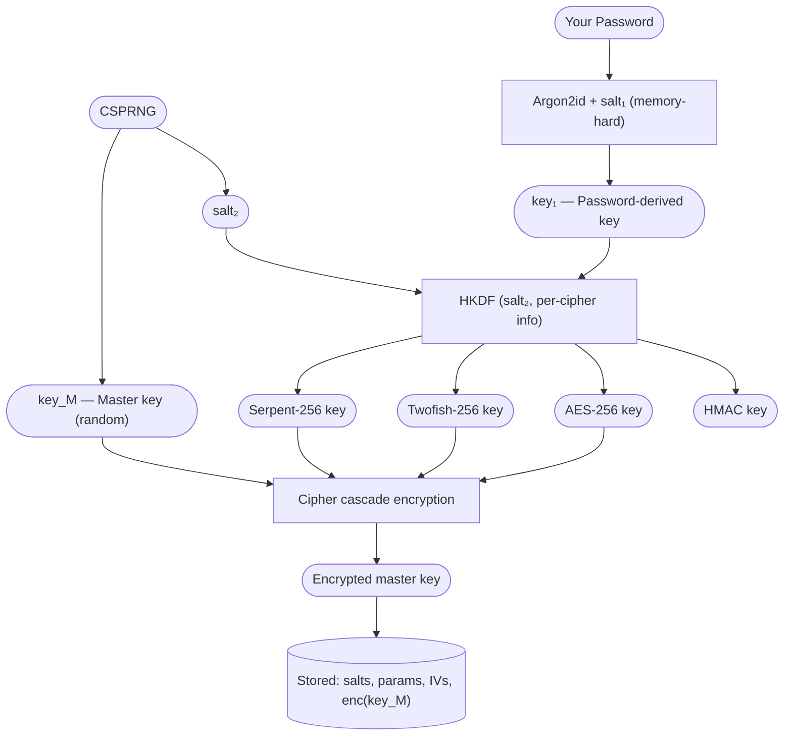
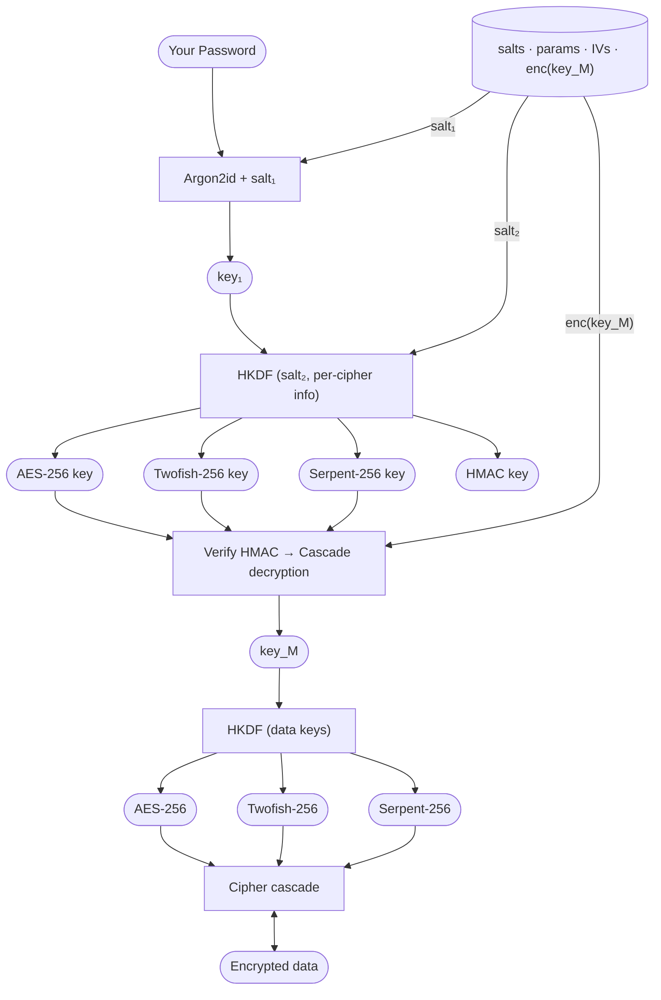

Consider your data secured inside multiple independent layers of protection. These layers are not physical barriers but well-studied cryptographic constructions designed to resist both current and future attacks.

Your password is never stored. It is used only to derive a key that unlocks a small encrypted container holding the actual vault key. The vault key is generated randomly and is entirely independent of your password. All user data is encrypted with this random key.

As a result:

- Changing your password does not require re-encrypting your data
- Your data security does not depend directly on password strength alone
- An attacker must defeat multiple independent cryptographic layers

*At no point do we have access to your password or your data. A stolen vault file reveals only indistinguishable random data.*

## Security Properties (Summary)

* **Password is never stored** — only a derived key is used
* **Data is encrypted with a random master key** — independent of the password
* **Password changes do not require re-encrypting data** — only the wrapped master key is updated
* **Multiple cipher layers** — reduces reliance on any single cipher
* **Integrity protection** — ciphertext and metadata are authenticated
* **No recovery mechanism** — no backdoors or server-side keys exist

## Technical Details

### Phase 1 — Vault Creation

#### Password Hardening

The password is transformed using [Argon2id](https://en.wikipedia.org/wiki/Argon2):

$$
\mathrm{key}_1 = \mathrm{Argon2id}(\mathrm{password}, \mathrm{salt}_1, m, t, p)
$$

Parameters:

* $m$ — memory cost
* $t$ — time cost
* $p$ — parallelism

These parameters are stored alongside $\mathrm{salt}_1$.

#### Master Key Generation

$$
\mathrm{key}_M \leftarrow {0,1}^{256}
$$

The master key is generated uniformly at random (256-bit entropy) and is independent of the password.

#### Wrap Key Derivation (HKDF)

First derive a pseudorandom key:

$$
\mathrm{PRK} = \mathrm{HKDF_Extract}(\mathrm{salt}_2, \mathrm{key}_1)
$$

Then expand per cipher:

$$
\mathrm{wrapKey}_i =
\mathrm{HKDF_Expand}(
\mathrm{PRK},
\mathrm{info} = \text{"wrap-cipher-}i\text{"},
L = 32
)
$$

Authentication key:

$$
k_{\mathrm{auth}} =
\mathrm{HKDF_Expand}(
\mathrm{PRK},
\mathrm{info} = \text{"auth"},
L = 64
)
$$

*Domain separation is enforced via distinct `info` values.*

#### Master Key Encryption

Each cipher operates in **CTR mode** with a unique random IV.

The master key is encrypted through a cascade:

$$
\begin{aligned}
c_1 &= \mathrm{Enc}*{\mathrm{AES\text{-}CTR}}(k_1, IV_1, \mathrm{key}*M) \
c_2 &= \mathrm{Enc}*{\mathrm{Twofish\text{-}CTR}}(k_2, IV_2, c_1) \
c_3 &= \mathrm{Enc}*{\mathrm{Serpent\text{-}CTR}}(k_3, IV_3, c_2)
\end{aligned}
$$

Authentication (Encrypt-then-MAC):

$$
\mathrm{final} =
\mathrm{HMAC}*{\mathrm{SHA512}}(
k*{\mathrm{auth}},
\mathrm{salt}_1 | m | t | p | \mathrm{salt}_2 | IV_1 | IV_2 | IV_3 | c_3
)
\ |\
IV_1 | IV_2 | IV_3 | c_3
$$

*IVs are generated via CSPRNG, are unique per encryption, and stored alongside the ciphertext.*

#### Stored Data

| Value                          | Description                     |
| ------------------------------ | ------------------------------- |
| $\mathrm{salt}_1$              | Argon2 salt                     |
| $(m, t, p)$                    | Argon2 parameters               |
| $\mathrm{salt}_2$              | HKDF salt                       |
| $IV_1, IV_2, IV_3$             | Per-layer IVs                   |
| $\mathrm{enc}(\mathrm{key}_M)$ | Ciphertext + authentication tag |

### Phase 2 — Vault Unlock

#### Re-deriving the Password Key

$$
\mathrm{key}_1 = \mathrm{Argon2id}(\mathrm{password}, \mathrm{salt}_1, m, t, p)
$$

#### Master Key Recovery

1. Recompute $\mathrm{key}_1$
2. Re-derive wrap keys and $k_{\mathrm{auth}}$
3. **Verify HMAC before decryption**
4. Decrypt cascade (reverse order):

$$
\begin{aligned}
c_2 &= \mathrm{Dec}*{\mathrm{Serpent\text{-}CTR}}(k_3, IV_3, c_3) \
c_1 &= \mathrm{Dec}*{\mathrm{Twofish\text{-}CTR}}(k_2, IV_2, c_2) \
\mathrm{key}*M &= \mathrm{Dec}*{\mathrm{AES\text{-}CTR}}(k_1, IV_1, c_1)
\end{aligned}
$$

Incorrect passwords or tampering result in authentication failure.

#### Data Key Derivation

$$
\mathrm{PRK}_D = \mathrm{HKDF_Extract}(\mathrm{salt}_2, \mathrm{key}_M)
$$

$$
\mathrm{dataKey}_i =
\mathrm{HKDF_Expand}(
\mathrm{PRK}_D,
\mathrm{info} = \text{"data-cipher-}i\text{"},
L = 32
)
$$

#### Data Encryption

User data is encrypted using the same cascade structure:

* CTR mode per cipher
* fresh random IVs per object
* Encrypt-then-MAC using HMAC-SHA512
* authentication covers ciphertext and all required metadata

## Algorithm Reference

| Algorithm          | Purpose                 |
| ------------------ | ----------------------- |
| Argon2id           | Password key derivation |
| HKDF-SHA512        | Key expansion           |
| AES-256-CTR        | Cipher layer            |
| Twofish-256-CTR    | Cipher layer            |
| Serpent-256-CTR    | Cipher layer            |
| XChaCha20-Poly1305 | Optional AEAD cipher    |
| HMAC-SHA512        | Authentication          |
| CSPRNG             | Random generation       |

## Threat Model

| Threat              | Mitigation                                 |
| ------------------- | ------------------------------------------ |
| Brute-force attacks | Argon2id with high cost                    |
| Stolen vault file   | Full encryption + authenticated decryption |
| Cipher failure      | Multi-cipher cascade                       |
| Tampering           | HMAC over ciphertext and metadata          |
| Key reuse           | HKDF domain separation                     |
| IV collision        | Random IVs per operation                   |
| Memory exposure     | Key zeroization                            |
